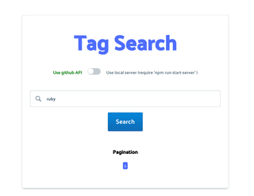
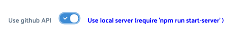

<!-- @format -->

# `github topic Search`

#### Simple tag seach practice 🚩

### requriments:

- node >= 8.4

## Usage:

### just run:

###### `npm install`

###### `npm run start`

#### if you want to run server:

### if you want to to run local server :

###### `npm run start-server`

##### this project was bootstrapped from create-react-app, just use:

### if you want to build:

###### `npm run build`

### if you want to run Test:

##### don't do it jet 🚫

###### `npm run test`

### if you want to Deploy web App:

###### `npm run build`

### if you want to Deploy server:

###### //comming soon
